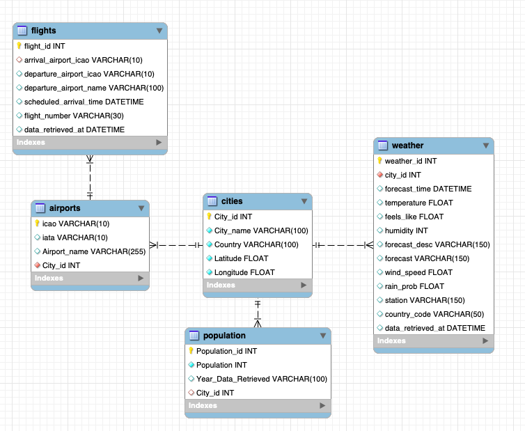
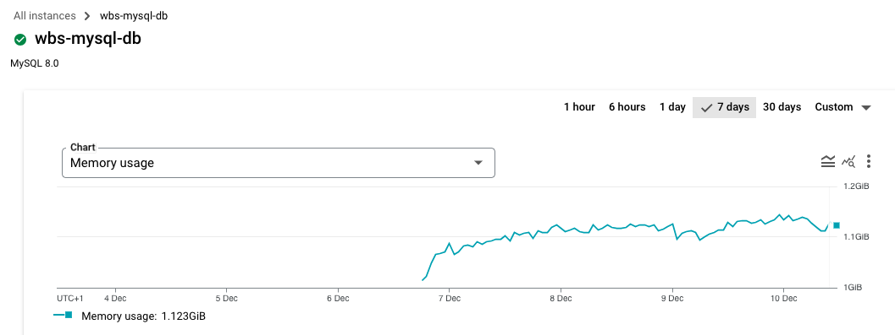
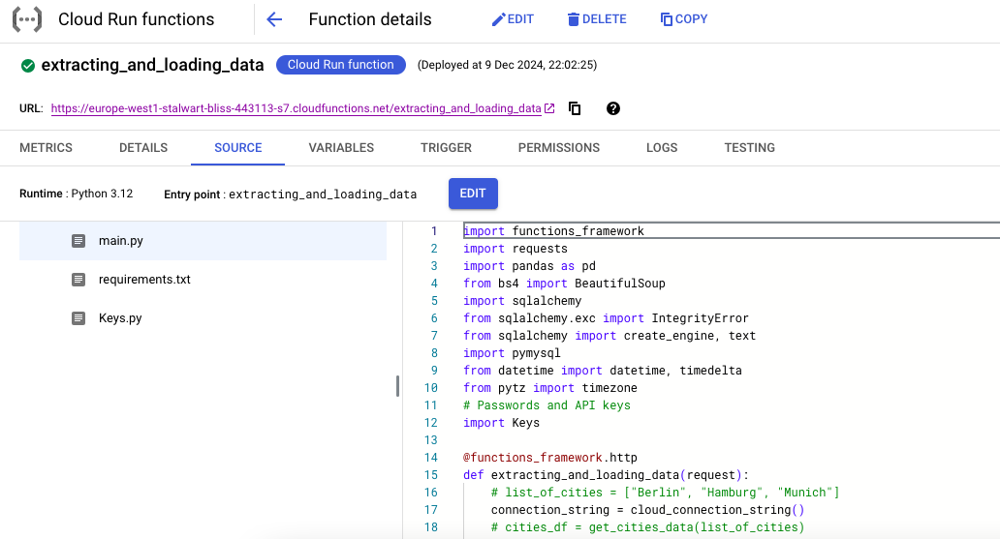
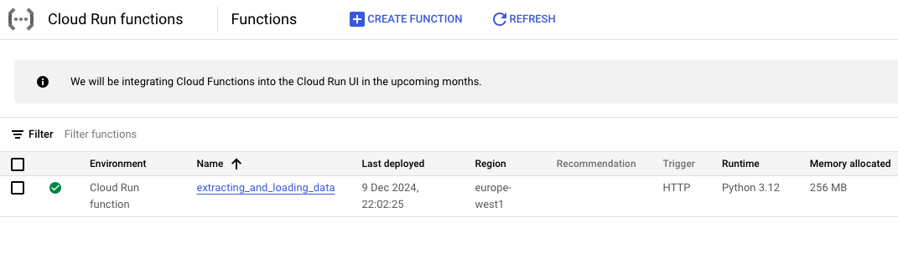
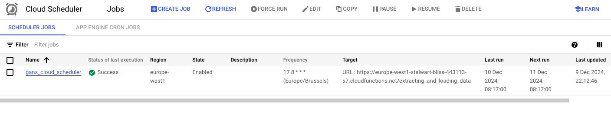

# ETL Pipeline for Weather, Flights, and City Insights

## 🌐 Overview

This repository showcases an ETL (Extract, Transform, Load) pipeline designed to collect, process, and integrate data about weather, flights, and city demographics. The project demonstrates how to build a reliable data pipeline for extracting external data, transforming it into usable formats, and loading it into a relational database for analysis and insights.

---

## 📊 Data Highlights

### **Weather Data** 🌤️
- Real-time forecasts for selected cities using the **OpenWeather API**.
- Includes temperature, humidity, wind speed, and weather descriptions for actionable insights.

### **Flight Data** ✈️
- Scheduled arrivals for nearby airports via the **Aerodatabox API**.
- Provides key data points like flight numbers, departure airports, and scheduled arrival times.

### **City Insights** 🏙️
- City population, latitude, and longitude scraped from **Wikipedia**.
- Data includes city names, countries, and geographic coordinates, enabling location-based analysis.

---

## 🛠️ Languages and Tools

- **Languages**: Python, SQL
- **APIs**: OpenWeather API, Aerodatabox API
- **Libraries**:
  - `requests` and `BeautifulSoup` for data extraction
  - `pandas` for data transformation
  - `sqlalchemy` for database integration
  - `functions-framework` for Google Cloud Functions
  - `pymysql` for MySQL database connections in the cloud
- **Databases**: MySQL, Google Cloud SQL (MySQL)

---

## 🚀 Quick Step-by-Step Instructions

### 🖥️ **Local Database Setup**

1. **Install Dependencies**:
   - Install **Python 3.x**.
   - Install **MySQL**.

2. **Install Required Libraries**.
3. **Set Up MySQL**:
   - Use **MySQL Workbench** for managing the database.
   - Create a new database schema using the provided script `database_schema.sql`

4. **Create API Keys**:
   - Obtain API keys for **OpenWeather** and **Aerodatabox**.
   - Store them securely in `Keys.py`.

5. **Run the ETL Pipeline**:
   - Open `etl_pipeline.ipynb` in your preferred IDE (Jupyter Notebook, VSCode, etc.).
   - Execute the cells to run the ETL process locally.

6. **Automate Locally**:
   - Use **Task Scheduler** (Windows) or **Cron Jobs** (Mac/Linux) to automate the pipeline.

7. 🎉 **Database Organized**:
   - Your data is now organized in the local MySQL database.

---

### ☁️ **Cloud Database Setup**

1. **Create a Google Cloud Platform Account**:
   - Sign up at [Google Cloud](https://cloud.google.com/) (credit/debit card required).
   - Use the **$300 free trial credits** for 3 months.

2. **Create a MySQL Database**:
   - Go to the **Cloud SQL** section in GCP.
   - Create a MySQL instance with minimal settings.

3. **Set Up Google Cloud Functions**:
   - Navigate to **Cloud Functions** in the GCP console.
   - Create a new function using the provided files:
     - `main_cloud_function.py`
     - `Keys_cloud_function.py`
     - `requirements_cloud_function.txt`

4. **Deploy the Function**:
   - Deploy the function and ensure it executes successfully. 

5. **Automate with Cloud Scheduler**:
   - Set up a **Cloud Scheduler** job to run the function at regular intervals.

6. 🎉 **Database Organized in the Cloud**:
   - Your data is now stored in the cloud MySQL database and updated automatically.

